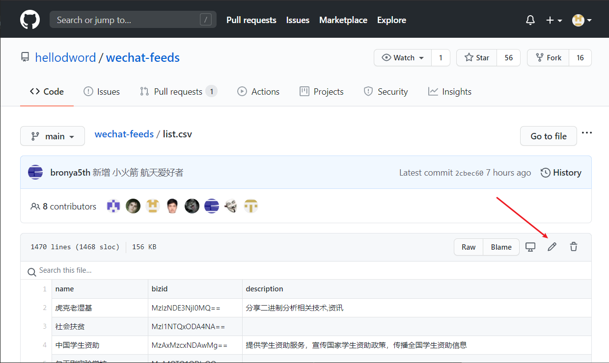
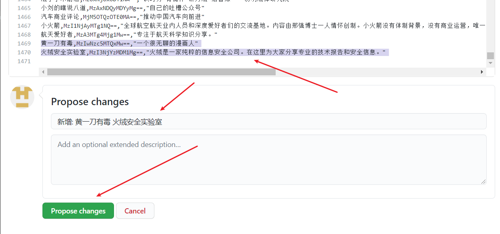
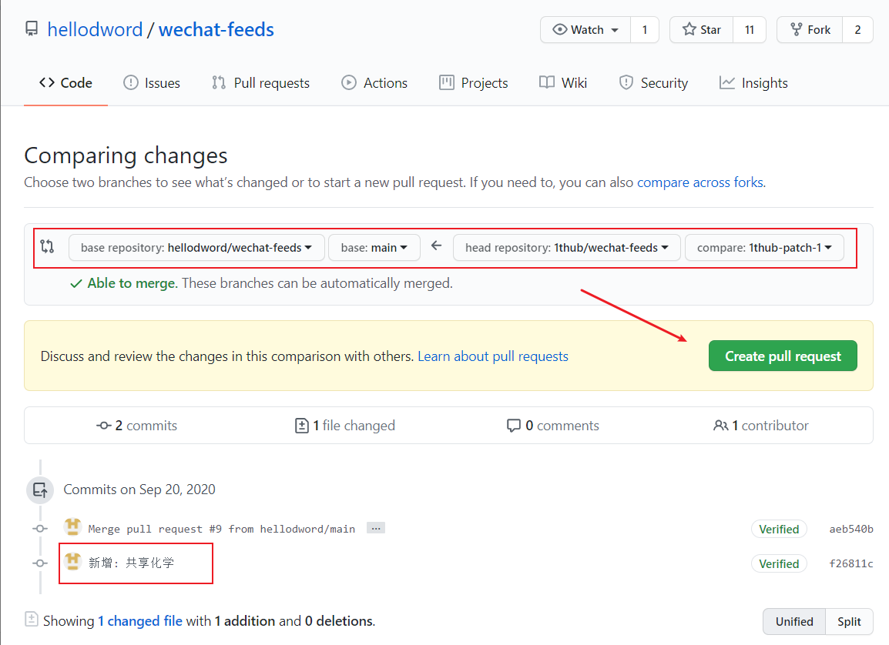
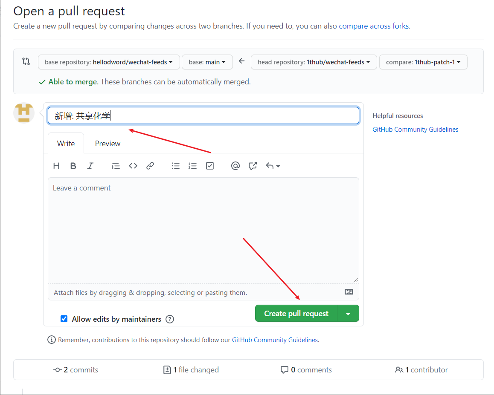
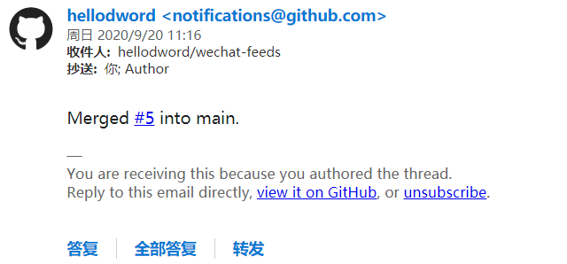
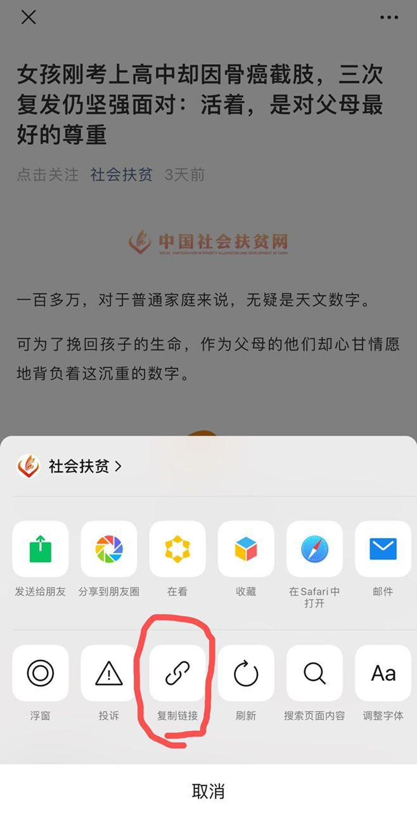
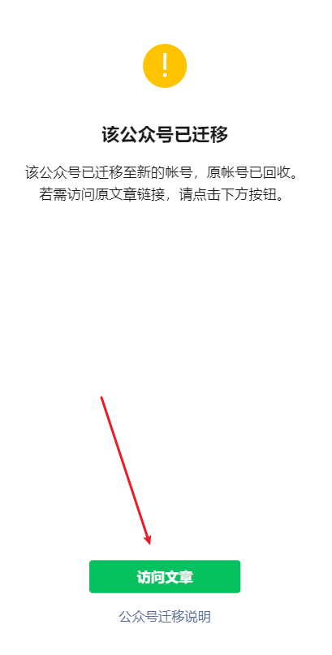

# WeChat-Feeds


---
<div align=center>
   <a href="https://github.com/hellodword/wechat-feeds/issues/3882">
      <font size=8><b>停止服务</b></font>
   </a>
</div>
<div align=center>
   <a href="https://github.com/hellodword/wechat-feeds/issues/3882">
      <font size=8><b>停止服务</b></font>
   </a>
</div>
<div align=center>
   <a href="https://github.com/hellodword/wechat-feeds/issues/3882">
      <font size=8><b>停止服务</b></font>
   </a>
</div>
    

---

<div align=center></div>


<p align="center">
   <a href="https://gitter.im/wechat-feeds/chat?utm_source=badge&utm_medium=badge&utm_campaign=pr-badge" alt="Gitter">
      
   </a>
   <br>
   <a href="http://wechat.privacyhide.com/" alt="Website">
      
   </a>
   <br>
   <a href="https://github.com/hellodword/wechat-feeds/graphs/contributors" alt="Contributors">
      
   </a>
   <a href="https://github.com/hellodword/wechat-feeds/pulse" alt="Activity">
      
   </a>
   <br>
   <a href="https://github.com/hellodword/wechat-feeds/network/members" alt="GitHub forks">
      
   </a>
   <a href="https://github.com/hellodword/wechat-feeds/stargazers" alt="GitHub stars">
      
   </a>
   <a href="https://github.com/hellodword?tab=followers" alt="GitHub followers">
      
   </a>
   <br>
   <a href="https://github.com/hellodword/wechat-feeds/issues" alt="GitHub issues">
      
   </a>
   <a href="https://github.com/hellodword/wechat-feeds/issues?q=is%3Aissue+is%3Aclosed" alt="GitHub closed issues">
      
   </a>
   <br>
   <a href="https://github.com/hellodword/wechat-feeds/pulls" alt="GitHub pr">
      
   </a>
   <a href="https://github.com/hellodword/wechat-feeds/pulls?q=is%3Apr+is%3Aclosed" alt="GitHub closed pr">
      
   </a>
   <br>
   <a href="https://github.com/settings/repositories" alt="GitHub repo size">
      
   </a>
</p>


* [WeChat-Feeds](#wechat-feeds)
   * [声明](#声明)
   * [隐私风险](#隐私风险)
   * [更新状态](#更新状态)
   * [如何使用](#如何使用)
   * [如何添加/修改公众号](#如何添加修改公众号)
   * [FAQ](#faq)
      * [如何获取 bizid?](#如何获取-bizid)
      * [服务是否稳定?](#服务是否稳定)
      * [feeds 更新频率如何?](#feeds-更新频率如何)
      * [数量是否有上限?](#数量是否有上限)
      * [是如何爬取的?](#是如何爬取的)
      * [csv 转义方式](#csv-转义方式)
      * [文章更新时间为什么对不上?](#文章更新时间为什么对不上)
      * [是否会开源?](#是否会开源)
      * [是否算滥用?](#是否算滥用)
   * [TODO](#todo)
   * [交流](#交流)
   * [更新状态](#更新状态)

---

> 给微信公众号生成 RSS 订阅源  

> 列表页 [https://wechat.privacyhide.com/](https://wechat.privacyhide.com/)  


众所周知, 微信公众号比较封闭, 爬取也有一定门槛, 对于 RSS 重度用户来说很不友好, 加上如今订阅号的推送也是乱序时间轴的, 作为在推荐算法的重重包围下做挣扎的一员, 希望在此借助 Github 为同好提供有限的订阅服务.

---
## 声明

收录的公众号均来自网友提交或者采集自公开榜单, 不代表任何立场; 所有内容均为手动抄录, 未进行任何逆向工程.

---

## 隐私风险

~~feeds 托管在 github 上, 所以我无法获取订阅这些 feeds 的用户的任何信息~~

2020/10/5: 在列表页新增了 [GA](https://github.com/hellodword/wechat-feeds/blob/82c14ebd869fe11618142d9a04b487b53988dd3e/index.html#L22-L30), 只是为了统计一下列表页的使用情况, 如有介意, 可以使用浏览器插件屏蔽或者用 [list.csv](https://github.com/hellodword/wechat-feeds/blob/main/list.csv) 手动搜索拼接链接代替列表页.

2021/03/07: [#895](https://github.com/hellodword/wechat-feeds/issues/895) 图标的实现会请求一台服务器, 代码见 [favicon](https://github.com/hellodword/wechat-feeds/tree/favicon), 是有能力获取订阅者的 IP 地址的. 我承诺我没有记录数据, 但我觉得就算我被信任, 这种仅仅建立在对个体的信任上的方式不健康, **有隐私风险**, 大家有什么好的办法可以 issue 与我交流

---

## 更新状态

> 如果需要某项实时通知, 可以点击对应页面的 Subscribe

- [更新状态](https://github.com/hellodword/wechat-feeds/issues/608#issuecomment-new)
- [异常状态](https://github.com/hellodword/wechat-feeds/issues/2471#issuecomment-new)
- [迁移/屏蔽/注销检测](https://github.com/hellodword/wechat-feeds/issues/2387#issuecomment-new)

--- 
## 如何使用

- 在 [列表页](https://wechat.privacyhide.com/) 中搜索你想要订阅的公众号, 点击复制链接

---
## 如何添加/修改公众号

> 本指南只针对不是很熟悉 github 的朋友, 方便大家直接在网页上提交 pr, 老手可忽略~

1. 首先要有一个 github 账户: [注册](https://github.com/join?source=login) | [登录](https://github.com/login)

2. 在浏览器中打开 [list.csv](https://github.com/hellodword/wechat-feeds/blob/main/list.csv), 先搜索有没有你需要的公众号, 确定没有则点击箭头指示的编辑按钮, 开始编辑



3. 拉到底部, 按照格式在文档的末尾 (箭头 1) 添加你想要添加的公众号, 根据下图的箭头指示添加完成后, 点击 **`Propose changes`**(箭头 3), 注意箭头 2 处按照如下格式填写: 
   - 以 **`新增:`** 开头, 注意冒号是 **半角字符**;
   - 用半角空格 ` ` 分隔公众号, 结尾不要空格, **注意 `新增:` 后面也有一个空格**, 例如 **`新增: 火绒安全实验室`**, **`新增: 火绒安全实验室 人民日报`**;
   - 多个公众号可以用概述, 同样用半角空格 ` ` 分隔, 结尾不要空格, 例如 **`新增: 火绒安全实验室 人民日报 等`**, **`新增: 36个游戏资讯公众号`**.



4. 网页跳转后来到如下页面则说明修改成功了, 开始提交 pr





5. **请务必在提交 pr 后保持可以接收到邮件提醒, GitHub 会通过邮件告诉你 pr 是否有问题, 有问题的 pr 请重新提交并及时关闭无效的 pr (下方的 Close), 不要提完 pr 就当作成功了, 目前自助没有什么问题, 请尽量自助解决.**



6. **注意事项**:
   1. **请确保每次 pr 只修改提交一次**.
   2. **在自己的 pr 没被处理前, 建议不要立刻提新的 pr, 推荐多个公众号 (64 个以内) 放在一次 pr 里, 或者关闭前一个 pr 重新提交**.
   3. 请确认自己的输入法, 分隔的标点符号为半角符号, 而不是全角符号, 区别请自行搜索.
   4. 直接在网页上拉到行尾添加, 以免破坏文件格式.
   5. 获取 `bizid`, 参见 [如何获取 bizid](#如何获取-bizid)
   6. `name` 和 `bizid` 为必需, `description` 可留空, `description` 内如有半角双引号、换行、逗号时, 需要转义, 参见 [csv 转义方式](#csv-转义方式)

---

## FAQ

### 如何获取 bizid?

#### 自动获取

1. 选择一篇文章复制链接



2. 在 [这里](https://github.com/hellodword/wechat-feeds/issues/new) 新开一个 issue, 标题随便填写, 内容填上链接, github actions 会自动抓取和回复数据, 只需要等待一会然后复制就可以了. 参考 [#1536](https://github.com/hellodword/wechat-feeds/issues/1536). 只监听新开 issue 的事件, edit 无效. 如果失败, 请 [手动获取](#手动获取)

#### 手动获取

<details>
<summary><b>展开查看</b></summary>

1. 选择一篇文章复制链接, 注意如果公众号已被永久屏蔽, 就不用再添加了, 会不定期清理已屏蔽的公众号; 如果公众号已迁移, 用迁移后的 bizid



2. 在浏览器中打开链接, 右键查看网页源代码, 搜索 `var biz`, 可以搜到 `var biz = ""||"MzI1NTQxODA4NA==";`, 那么 `MzI1NTQxODA4NA==` 也就是需要的 bizid

</details>

### 服务是否稳定?

完全不敢保证, 抱歉 (项目的特殊性决定了一切说绝对稳定的都是过度自信)

### feeds 更新频率如何?

大致时间点:

07,11,13,16,20,23

如果有更好的时间点设计欢迎 [告诉我](#交流), 因为凌晨这段时间推送的更新很少, 抓取有点浪费


### 数量是否有上限?

鉴于账号限制, 暂时只打算提供 20000 个公众号的服务, 每个 feed 至多只保留20篇

### 是如何爬取的?

真实: 全部是我一条一条定时手动抄录的, 一个小时最多抄录两万个公众号的内容.

### csv 转义方式

<details>
<summary><b>展开查看</b></summary>

**首先确保你的输入法切换到半角符号状态**


1. 如果内容中有**半角**双引号, 需要在每个**半角**双引号前面再加一个**半角**双引号来转义, 然后将内容用一对**半角**双引号包起来:

   假设需要转义的内容为:

   ```
   它说:"你好"
   ```

   则改为:

   ```
   "它说:""你好"""
   ```

2. 如果内容中有**半角**逗号, 将内容用一对**半角**双引号包起来:

   假设需要转义的内容为:

   ```
   你好,世界
   ```

   则改为:

   ```
   "你好,世界"
   ```

3. 如果内容中有换行, 要将整个内容都用一对**半角**双引号包起来:

   > 不建议包含换行

   假设需要转义的内容为:

   ```
   它说:"你好世界"
   它说:"知道了"
   ```

   则改为:

   ```
   "它说:""你好世界""
   它说:""知道了"""
   ```
   
</details>


---

### 文章更新时间为什么对不上?

> 参见 [issue 390](https://github.com/hellodword/wechat-feeds/issues/390#issuecomment-743722383) 

> 我看了下这个公众号, 它每天推送时间都是上午8:30, 所以我猜测它是定时发布的, 而 feeds 中显示的时间就是微信服务器收到这篇文章的时间, .

> 比如 [这一篇](https://mp.weixin.qq.com/s/Beh1Lgmvtb29HIq2_v9Gpg) , 8:30 对应的 1607733000 在它的网页源码中可以看到, 所以其实这和抓取全文可能是同一个范畴的问题

---

### 是否会开源?

> 可公开的部分见各个分支的源码, 有编程能力的可以反代并且自建图标服务器消除隐私风险和 MIME 的问题, 除此之外暂无开源计划, 况且我真是手动抄录的 

---

### 是否算滥用?

> 是否算滥用 github 这个问题, 我查阅了很久 [ToS](https://docs.github.com/en/github/site-policy/github-terms-of-service), 我认为对于此项目来说是不算的, 欢迎与我讨论此点.

---
## TODO

- [x] 根据 list.csv 生成列表页, 通过 pages 展示 (感谢 [Treblex](https://github.com/Treblex) 的 [Treblex/wechat-feeds-page](https://github.com/Treblex/wechat-feeds-page), 感谢 [shulandmimi](https://github.com/shulandmimi))
- [x] 给 pr 和 commit 添加自动 checks
- [x] 给 issue 添加 actions, 来自动获取 bizid 等
- [x] 兼容迁移公众号/自动移除已屏蔽公众号
- [x] 列表页性能提升, 一次性加载性能压力太大
- [ ] 考虑添加更多可供列表页搜索/过滤的属性, 例如微信号、 TAG 等
- [ ] 考虑 feeds 分支使用 force push, 以避免触及[仓库容量预警上限](https://docs.github.com/cn/github/managing-large-files/what-is-my-disk-quota#file-and-repository-size-limitations)

---

## 交流

> 首推 [issues](https://github.com/hellodword/wechat-feeds/issues)

> 有什么需要频繁交流的问题和建议可以在 [](https://gitter.im/wechat-feeds/chat?utm_source=badge&utm_medium=badge&utm_campaign=pr-badge) 交流, 当然在这之前建议先阅读本文档.


