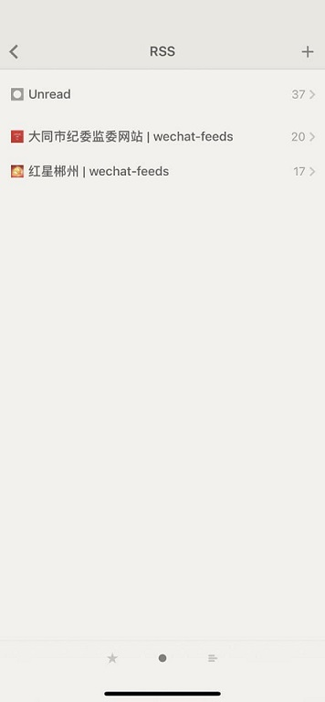
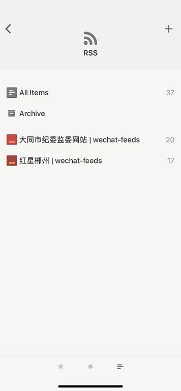
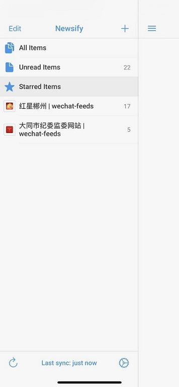
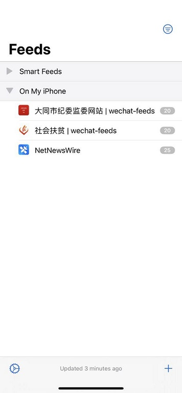

# Favicon

|  阅读器 |  支持情况 | UA |
| --- | --- | --- |
| Feedbro | **Favicon provider**   [duckduckgo](https://icons.duckduckgo.com/ip3/mzi1otiznjm5nw.favicon.privacyhide.com.ico) 很容易不支持   [google](https://www.google.com/s2/favicons?domain=mza3otc1oduxng.favicon.privacyhide.com) 支持好很多 | 浏览器的 UA |
| Reeder 4 | 不支持，但是会选取占比高的颜色生成色块 |  `Reeder/4020.89.01`   `Reeder/4020.69.02` |
| Reeder 3 | 支持 | `Reeder/3.2.40` |
| Newsify | 支持 | `Newsify/469` |
| RSS Feed Reader (Chrome) | 支持 | |
| inoreader | 不支持 | |
| NetNewsWire | 支持 | |
| Tiny Tiny RSS | 未测试 | `Tiny Tiny RSS/21.03` |
| irreader | 未测试 | `irreader/1.5.9` |
| Miniflux | 未测试 | `Miniflux/2.0.28` |

TODO:

- [ ] 将 png 转为 ico
- [ ] 优化 favicon 访问速度
- [ ] 兼容更多阅读器

