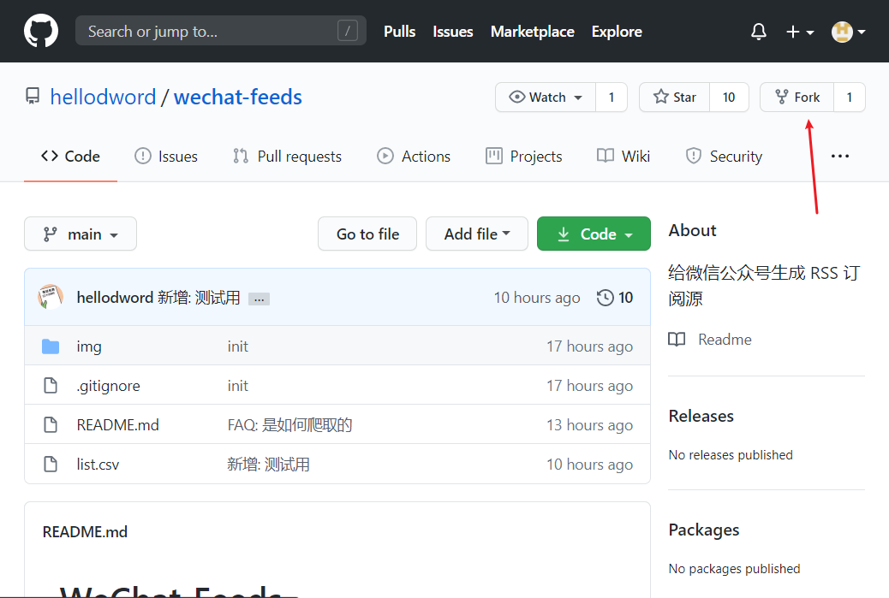
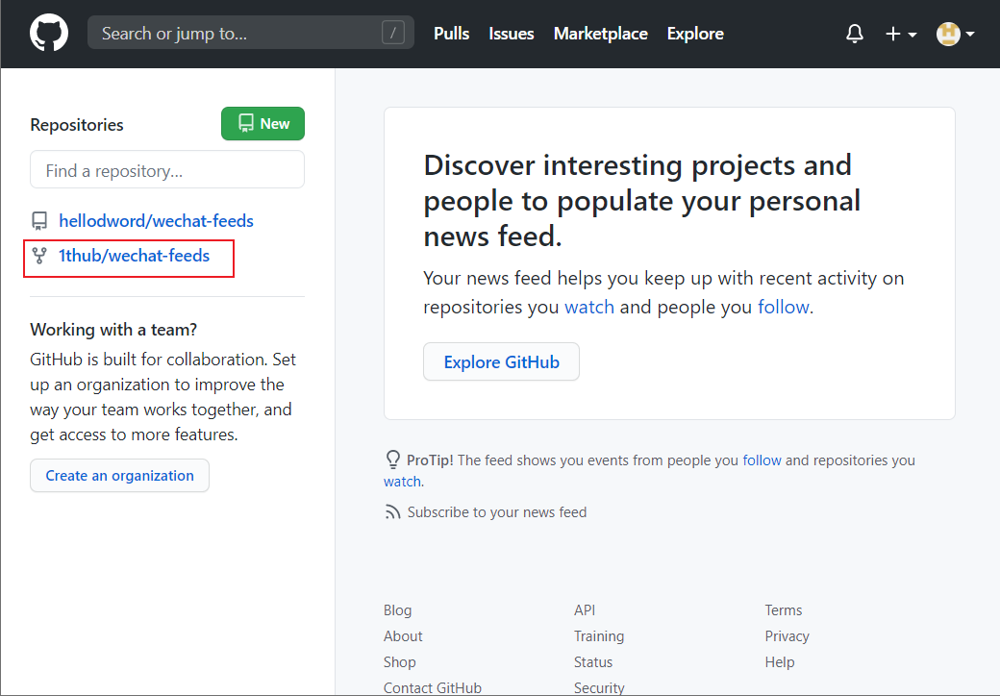
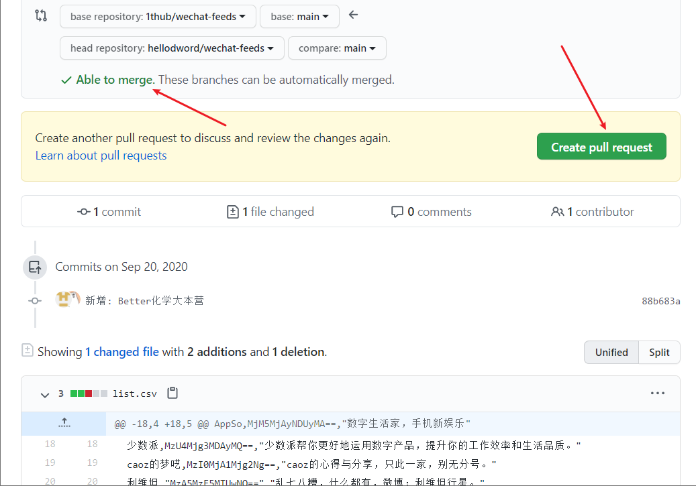
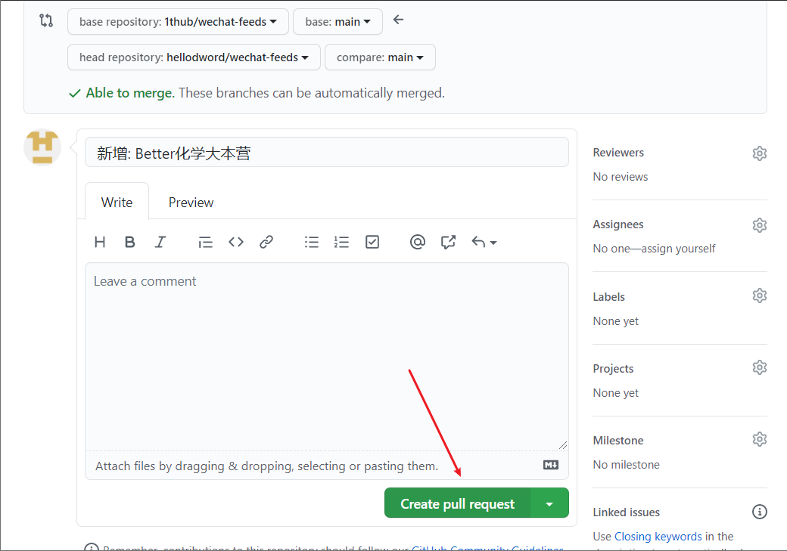
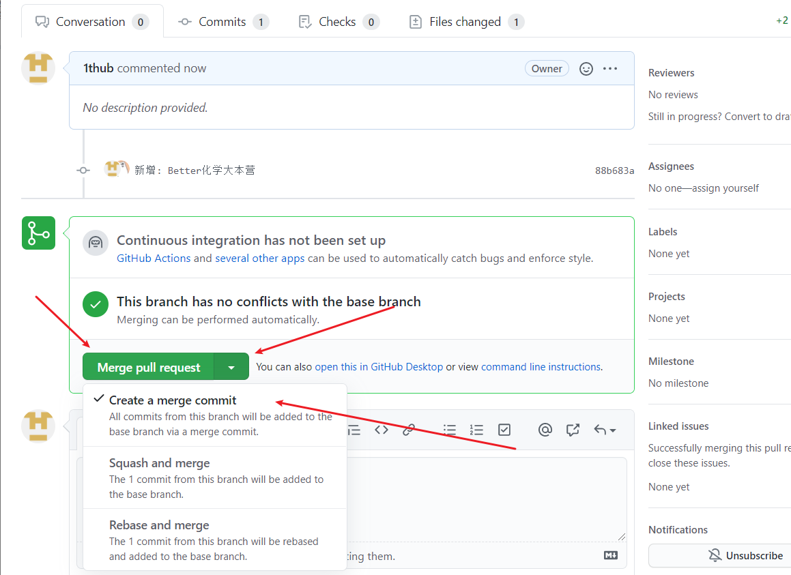
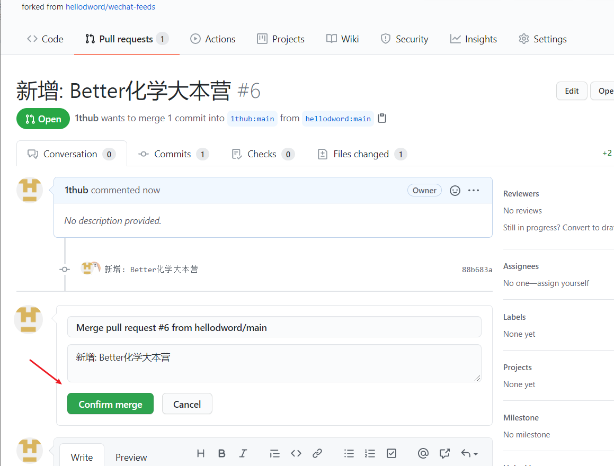
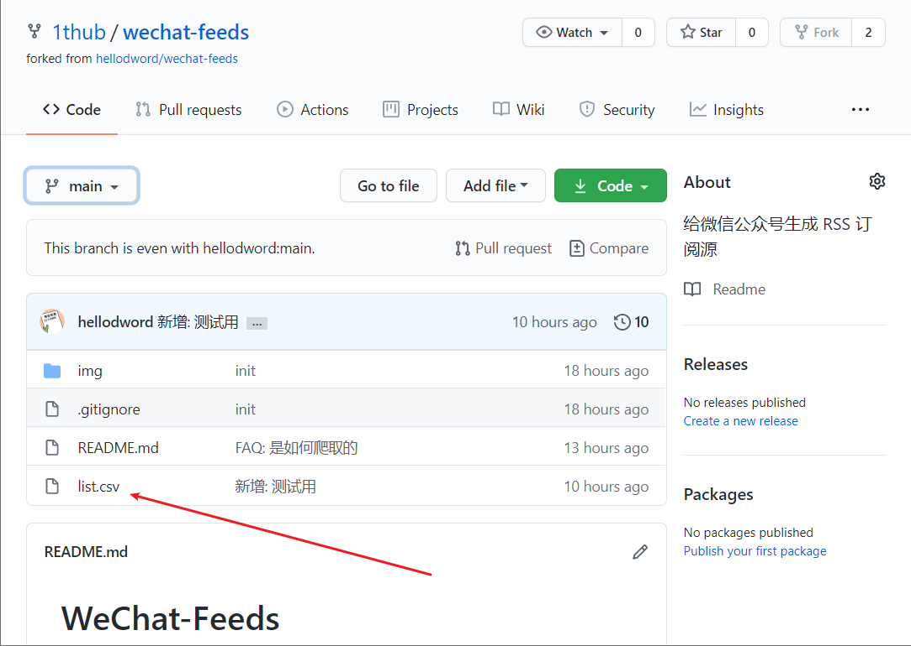
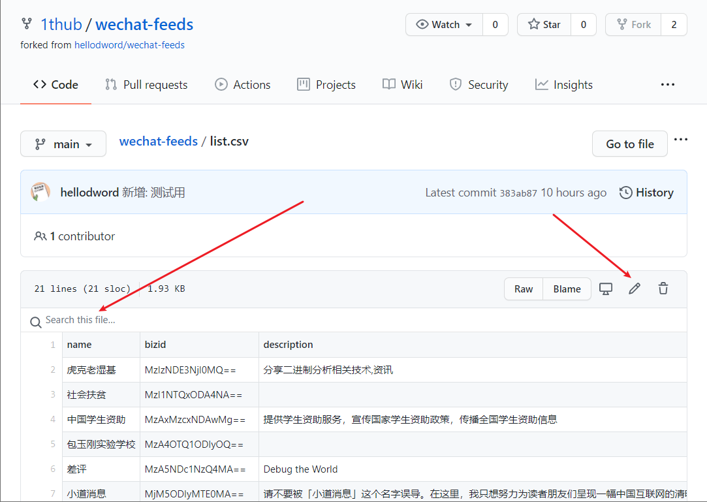
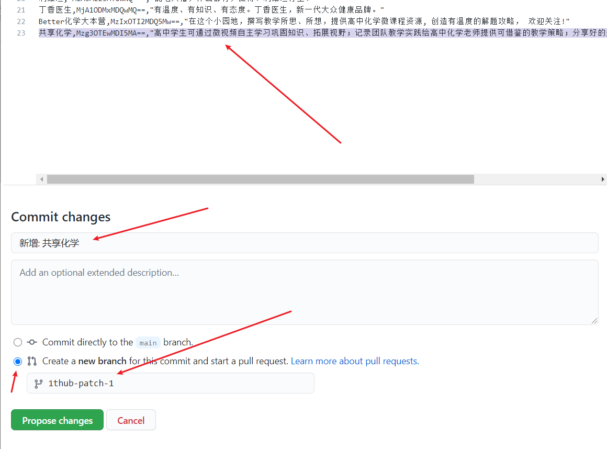

# WeChat-Feeds

> 给微信公众号生成 RSS 订阅源

Table of Contents
=================

   * [WeChat-Feeds](#wechat-feeds)
      * [结构](#结构)
         * [main](#main)
         * [feeds](#feeds)
      * [添加/修改公众号](#添加修改公众号)
      * [FAQ](#faq)
         * [为什么选用 bizid?](#为什么选用-bizid)
         * [如何获取 bizid?](#如何获取-bizid)
         * [服务是否稳定?](#服务是否稳定)
         * [feeds 更新频率如何?](#feeds-更新频率如何)
         * [数量是否有上限?](#数量是否有上限)
         * [是否有隐私风险?](#是否有隐私风险)
         * [是如何爬取的?](#是如何爬取的)
         * [国内加速](#国内加速)
      * [TODO](#todo)

众所周知微信公众号比较封闭, 爬取也有一定门槛, 对于 RSS 重度用户来说很不友好, 加上如今订阅号的推送也是乱序时间轴的, 作为在推荐算法的重重包围下做挣扎的一员, 希望在此借助 Github 为同好提供有限的订阅服务.


## 结构


### main
主分支 `main` 的结构:

```
.
├── README.md
└── list.csv
```

1. [README.md](https://github.com/hellodword/wechat-feeds/blob/main/README.md)
2. [list.csv](https://github.com/hellodword/wechat-feeds/blob/main/list.csv): 待爬取的列表, 由 `name`, `bizid`, `description` 组成的无序列表

### feeds
分支 `feeds` 将储存更新的 feeds, 所有 feeds 将采用 [Atom](https://tools.ietf.org/html/rfc4287) 标准. 例如:

1. [虎克老湿基](https://github.com/hellodword/wechat-feeds/raw/feeds/MzIzNDE3NjI0MQ==.xml) 的 `bizid` 为 `MzIzNDE3NjI0MQ==`, 则其 feed 为 [`https://github.com/hellodword/wechat-feeds/raw/feeds/MzIzNDE3NjI0MQ==.xml`](https://github.com/hellodword/wechat-feeds/raw/feeds/MzIzNDE3NjI0MQ==.xml)

2. [社会扶贫](https://github.com/hellodword/wechat-feeds/raw/feeds/MzI1NTQxODA4NA==.xml) 的 `bizid` 为 `MzI1NTQxODA4NA==`, 则其 feed 为 [`https://github.com/hellodword/wechat-feeds/raw/feeds/MzI1NTQxODA4NA==.xml`](https://github.com/hellodword/wechat-feeds/raw/feeds/MzI1NTQxODA4NA==.xml)


## 添加/修改公众号

> fork -> 修改 list.csv -> pull request  
> 本指南只针对不是很熟悉 github 的朋友, 老手可忽略~

1. 首先要有一个 github 账户: [注册](https://github.com/join?source=login)  [登录](https://github.com/login)

2. 登录后如下图 fork 本仓库(~~star watch 三连当然更好啦~~), 已经 fork 过则跳过这一步



3. 打开 [首页](https://github.com/), 打开你 fork 的仓库



4. 如果上游代码有变动, 需要跟上游同步, 这个相对比较复杂, 所以建议直接打开 `https://github.com/<你的github用户名>/wechat-feeds/compare/main...hellodword:main`, 如果上游已更新, 则按照如下操作来更新你 fork 后的仓库






5. 先在 list.csv 中查找以确定没有你需要添加的公众号, 再修改 list.csv
    1. 直接在网页上拉到行尾添加, 以免破坏文件格式
    2. 获取 `bizid`, 参见 [为什么选用 bizid](#为什么选用-bizid) 和 [如何获取 bizid](#如何获取-bizid)
    3. `name` 和 `bizid` 为必需, `description` 可留空, `description` 内如有双引号、换行、逗号时, 需要转义, 自行搜索转义方式




6. 认真添加完你需要的公众号后, 提交 commit, 注意按照图中的指示填写和操作, 会自动生成一个分支名, 请记下来, 然后点击 `Propose changes` 提交 commit, 点击跳转之后直接去第7步



7. 一切顺利的话就可以提交 pr 给上游也就是本仓库了, 直接打开 `https://github.com/hellodword/wechat-feeds/compare/main...<你的github用户名>:<第6步记下来的分支名>`


8. 接下来你就可以通过 github 或者 Email 查看这个 pr 是否被合并, 或者是否被要求更改


## FAQ

### 为什么选用 bizid?

因为公众号名称或者是微信号都是可以修改的, 而其它的唯一ID对于普通用户来说比较难获取, 或许未来可以考虑做一个插件来直接获取公众号真正的唯一ID

### 如何获取 bizid?

1. 选择一篇文章复制链接


2. 在浏览器中打开链接, 右键查看网页源代码, 搜索 `var biz`, 可以搜到 `var biz = ""||"MzI1NTQxODA4NA==";`, 那么 `MzI1NTQxODA4NA==` 也就是需要的 bizid

### 服务是否稳定?

完全不敢保证, 抱歉

### feeds 更新频率如何?

暂定两个小时一次

### 数量是否有上限?

鉴于账号限制, 暂时只打算提供10000个公众号的服务, 每个 feed 至多只保留20篇

### 是否有隐私风险?

feeds 托管在 github 上, 我无法获取订阅这些 feeds 的用户的任何信息

### 是如何爬取的?

真实: 全部是我一条一条定时手动抄录的, 一个小时最多抄录两万个公众号的内容.

### 国内加速

已将 feeds 分支同步更新到 [gitee](https://gitee.com/BlogZ/wechat-feeds), 所以 [`https://github.com/hellodword/wechat-feeds/raw/feeds/MzIzNDE3NjI0MQ==.xml`](https://github.com/hellodword/wechat-feeds/raw/feeds/MzIzNDE3NjI0MQ==.xml) 对应的国内加速地址为 [`https://gitee.com/BlogZ/wechat-feeds/raw/feeds/MzIzNDE3NjI0MQ==.xml`](https://gitee.com/BlogZ/wechat-feeds/raw/feeds/MzIzNDE3NjI0MQ==.xml)


## TODO

- [x] 同步 gitee 提升访问体验
- [ ] 根据 list.csv 生成精美一些的列表页, 通过 pages 展示
- [ ] 添加 item description
- [ ] 思考更简单的添加公众号的方式, 前提是继续控制成本
- [ ] 思考如何用低成本实现添加全文