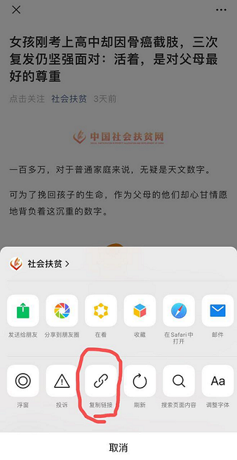

# WeChat-Feeds


> 给微信公众号生成 RSS 订阅源

众所周知微信公众号比较封闭, 爬取也有一定门槛, 对于 RSS 重度用户来说很不友好, 加上如今订阅号的推送也是乱序时间轴的, 作为在推荐算法的重重包围下做挣扎的一员, 希望在此借助 Github 为同好提供有限的订阅服务.


## 结构


### main
主分支 `main` 的结构:

```
.
├── README.md
└── list.csv
```

1. [README.md](https://github.com/hellodword/wechat-feeds/blob/main/README.md)
2. [list.csv](https://github.com/hellodword/wechat-feeds/blob/main/list.csv): 待爬取的列表, 由 `name`, `bizid`, `description` 组成的无序列表

### feeds
分支 `feeds` 将储存更新的 feeds, 所有 feeds 将采用 [Atom](https://tools.ietf.org/html/rfc4287) 标准. 例如:

1. [虎克老湿基](https://github.com/hellodword/wechat-feeds/raw/feeds/MzIzNDE3NjI0MQ==.atom) 的 `bizid` 为 `MzIzNDE3NjI0MQ==`, 则其 feed 为 [`https://github.com/hellodword/wechat-feeds/raw/feeds/MzIzNDE3NjI0MQ==.atom`](https://github.com/hellodword/wechat-feeds/raw/feeds/MzIzNDE3NjI0MQ==.atom)

2. [社会扶贫](https://github.com/hellodword/wechat-feeds/raw/feeds/MzI1NTQxODA4NA==.atom) 的 `bizid` 为 `MzI1NTQxODA4NA==`, 则其 feed 为 [`https://github.com/hellodword/wechat-feeds/raw/feeds/MzI1NTQxODA4NA==.atom`](https://github.com/hellodword/wechat-feeds/raw/feeds/MzI1NTQxODA4NA==.atom)


## 添加/修改公众号

> fork -> 修改 list.csv -> pull request

1. fork

2. 修改 list.csv
    1. 获取 `bizid`, 参见 [为什么选用 bizid](#为什么选用-bizid) 和 [如何获取 bizid](#如何获取-bizid)
    2. 选择 csv 是为了方便不是很熟悉各种文件格式的人群, 分隔符为半角逗号, 文件编码为 `UTF8 with BOM`, 换行为 `LF`, 请务必用 Excel、WPS或者可以对其正常编辑而不破坏编码和换行的文本编辑器进行编辑
    3. `name` 和 `bizid` 为必需, `description` 可留空, `description` 内如有双引号、换行、逗号时, 需要转义, 自行搜索转义方式

3. pull request


## FAQ

### 为什么选用 bizid?

因为公众号名称或者是微信号都是可以修改的, 而其它的唯一ID对于普通用户来说比较难获取, 或许未来可以考虑做一个插件来直接获取公众号真正的唯一ID

### 如何获取 bizid?

1. 选择一篇文章复制链接



2. 在浏览器中打开链接, 右键查看网页源代码, 搜索 `var biz`, 可以搜到 `var biz = ""||"MzI1NTQxODA4NA==";`, 那么 `MzI1NTQxODA4NA==` 也就是需要的 bizid

### 服务是否稳定?

完全不敢保证, 抱歉

### feeds 更新频率如何?

暂定两个小时一次

### 数量是否有上限?

鉴于账号限制, 暂时只打算提供10000个公众号的服务, 每个 feed 至多只提供20篇

### 是否有隐私风险?

feeds 托管在 github 上, 我无法获取订阅这些 feeds 的用户的任何信息

### 是如何爬取的?

真实: 全部是我一条一条定时手动抄录的, 一个小时最多抄录两万个公众号的内容.

### 国内访问速度

后续会将 feeds 分支同步更新到 [gitee](https://gitee.com/BlogZ/wechat-feeds)