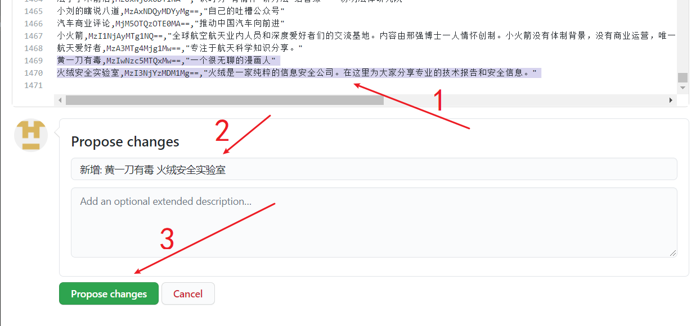
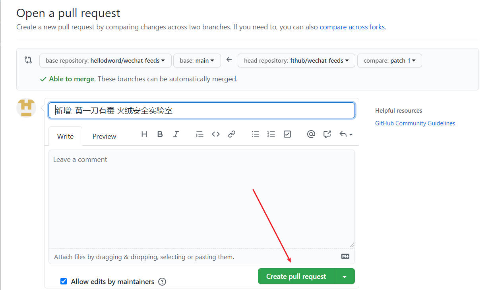

# WeChat-Feeds

<div align=center></div>

> 给微信公众号生成 RSS 订阅源

* [WeChat-Feeds](#wechat-feeds)
   * [声明](#声明)
   * [如何使用](#如何使用)
   * [如何添加/修改公众号](#如何添加修改公众号)
   * [FAQ](#faq)
      * [为什么选用 bizid?](#为什么选用-bizid)
      * [如何获取 bizid?](#如何获取-bizid)
      * [服务是否稳定?](#服务是否稳定)
      * [feeds 更新频率如何?](#feeds-更新频率如何)
      * [数量是否有上限?](#数量是否有上限)
      * [是否有隐私风险?](#是否有隐私风险)
      * [是如何爬取的?](#是如何爬取的)
      * [国内加速](#国内加速)
      * [csv 转义方式](#csv-转义方式)
   * [结构](#结构)
      * [main](#main)
      * [feeds](#feeds)
   * [TODO](#todo)

众所周知, 微信公众号比较封闭, 爬取也有一定门槛, 对于 RSS 重度用户来说很不友好, 加上如今订阅号的推送也是乱序时间轴的, 作为在推荐算法的重重包围下做挣扎的一员, 希望在此借助 Github 为同好提供有限的订阅服务.

---
## 声明

收录的公众号均来自网友提交或者公开榜单, 不代表任何立场; 内容均为手动抄录, 未进行任何逆向工程.

--- 
## 如何使用

1. 所有 feeds 将采用 [Atom](https://tools.ietf.org/html/rfc4287) 标准, 请确保你的 RSS 订阅工具支持这种标准  

2. 在 [list.csv](https://github.com/hellodword/wechat-feeds/blob/main/list.csv) 中查找名称, 或者根据 `bizid` 查找会最精准, 参见 [如何获取 bizid](#如何获取-bizid). 例如:

   1. [虎克老湿基](https://github.com/hellodword/wechat-feeds/raw/feeds/MzIzNDE3NjI0MQ==.xml) 的 `bizid` 为 `MzIzNDE3NjI0MQ==`, 则其 feed 为 [`https://github.com/hellodword/wechat-feeds/raw/feeds/MzIzNDE3NjI0MQ==.xml`](https://github.com/hellodword/wechat-feeds/raw/feeds/MzIzNDE3NjI0MQ==.xml)

   2. [社会扶贫](https://github.com/hellodword/wechat-feeds/raw/feeds/MzI1NTQxODA4NA==.xml) 的 `bizid` 为 `MzI1NTQxODA4NA==`, 则其 feed 为 [`https://github.com/hellodword/wechat-feeds/raw/feeds/MzI1NTQxODA4NA==.xml`](https://github.com/hellodword/wechat-feeds/raw/feeds/MzI1NTQxODA4NA==.xml)

3. 以上为 github 上的地址, 国内访问参见 [国内加速](#国内加速)

---
## 如何添加/修改公众号

> 本指南只针对不是很熟悉 github 的朋友, 方便大家直接在网页上提交 pr, 老手可忽略~

1. 首先要有一个 github 账户: [注册](https://github.com/join?source=login) | [登录](https://github.com/login)

2. 如果你不熟悉 GitHub 同步上游的操作, 就先在浏览器中打开 `https://github.com/<你的github用户名>/wechat-feeds/settings#danger-zone`, **如果能成功访问没有 404**, 说明你之前 fork 过, 则点击 `Delete this repository` 并按照提示操作来删除你 fork 后的仓库. **同时这也是接下来每一步操作遇到问题的终极解决办法**.


3. 在浏览器中打开 [list.csv](https://github.com/hellodword/wechat-feeds/blob/main/list.csv), 先搜索有没有你需要的公众号, 确定没有则点击箭头指示的编辑按钮, 开始编辑


4. **注意事项**:
   1. 可以一次性添加多个, 但同一个pr里不建议超过20个, 可以多次提交pr.
   2. 请确认自己的输入法, 分隔的标点符号为半角符号, 而不是全角符号, 区别请自行搜索
   3. 直接在网页上拉到行尾添加, 以免破坏文件格式
   4. 获取 `bizid`, 参见 [如何获取 bizid](#如何获取-bizid)
   5. `name` 和 `bizid` 为必需, `description` 可留空, `description` 内如有半角双引号、换行、逗号时, 需要转义, 参见 [csv 转义方式](#csv-转义方式)


根据下图的箭头指示添加完成后, 点击 **`Propose changes`**



5. 网页跳转后来到如下页面则说明修改成功了, 开始提交 pr





6. 接下来你就可以通过 github 或者 Email 查看这个 pr 是否被合并, 或者是否被要求更改


---

## FAQ

### 为什么选用 bizid?

因为公众号名称或者是微信号都是可以修改的, 而其它的唯一ID对于普通用户来说比较难获取, 或许未来可以考虑做一个插件来直接获取公众号真正的唯一ID

### 如何获取 bizid?

1. 选择一篇文章复制链接


2. 在浏览器中打开链接, 右键查看网页源代码, 搜索 `var biz`, 可以搜到 `var biz = ""||"MzI1NTQxODA4NA==";`, 那么 `MzI1NTQxODA4NA==` 也就是需要的 bizid

### 服务是否稳定?

完全不敢保证, 抱歉

### feeds 更新频率如何?

~~暂定两个小时一次~~

发现太频繁了抓取到的信息达不到预期, 改为七个时间点:

01,07,11,13,16,20,23

如果有更好的时间点设计欢迎issue告诉我, 因为凌晨这段时间推送的更新很少, 抓取有点浪费


### 数量是否有上限?

鉴于账号限制, 暂时只打算提供10000个公众号的服务, 每个 feed 至多只保留20篇

### 是否有隐私风险?

feeds 托管在 github 上, 我无法获取订阅这些 feeds 的用户的任何信息

### 是如何爬取的?

真实: 全部是我一条一条定时手动抄录的, 一个小时最多抄录两万个公众号的内容.

### 国内加速

已将 feeds 分支同步更新到 [gitee](https://gitee.com/BlogZ/wechat-feeds), 所以只需要改变地址的前半部分, 例如:  
[`https://github.com/hellodword/wechat-feeds/raw/feeds/MzIzNDE3NjI0MQ==.xml`](https://github.com/hellodword/wechat-feeds/raw/feeds/MzIzNDE3NjI0MQ==.xml)  

对应的国内加速地址为:  
[`https://gitee.com/BlogZ/wechat-feeds/raw/feeds/MzIzNDE3NjI0MQ==.xml`](https://gitee.com/BlogZ/wechat-feeds/raw/feeds/MzIzNDE3NjI0MQ==.xml)


### csv 转义方式

**首先确保你的输入法切换到半角符号状态**


1. 如果内容中有**半角**双引号, 需要在每个**半角**双引号前面再加一个**半角**双引号来转义, 然后将内容用一对**半角**双引号包起来:

   假设需要转义的内容为: 

   ```
   它说:"你好"
   ```

   则改为: 

   ```
   "它说:""你好"""
   ```

2. 如果内容中有**半角**逗号, 将内容用一对**半角**双引号包起来:

   假设需要转义的内容为: 

   ```
   你好,世界
   ```

   则改为: 

   ```
   "你好,世界"
   ```

3. 如果内容中有换行, 要将整个内容都用一对**半角**双引号包起来:

   > 不建议包含换行

   假设需要转义的内容为: 

   ```
   它说:"你好世界"
   它说:"知道了"
   ```

   则改为: 

   ```
   "它说:""你好世界""
   它说:""知道了"""
   ```

---

## 结构


### main
主分支 `main` 的结构:

```
.
├── README.md
└── list.csv
```

1. [README.md](https://github.com/hellodword/wechat-feeds/blob/main/README.md)
2. [list.csv](https://github.com/hellodword/wechat-feeds/blob/main/list.csv): 待爬取的列表, 由 `name`, `bizid`, `description` 组成的无序列表

### feeds

分支 `feeds` 将储存更新的 feeds

---
## TODO

- [x] 同步 gitee 提升访问体验
- [ ] 根据 list.csv 生成精美一些的列表页, 通过 pages 展示
- [ ] 添加 item description
- [ ] 思考更简单的添加公众号的方式, 前提是继续控制成本
- [ ] 思考如何用低成本实现添加全文
- [ ] 给 pr 和 commit 添加自动 checks
- [ ] 思考分类
- [ ] 考虑 feeds 分支使用 force push, 以避免触及[仓库容量预警上限](https://docs.github.com/cn/github/managing-large-files/what-is-my-disk-quota#file-and-repository-size-limitations)